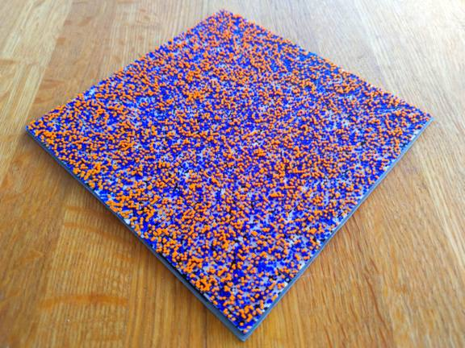

# Blender-genom-importer
Create 3d representasion of genome data in Blender

## How to Use
1. Go to the blener scripting tab.

2. Open `genom_importer.py`.

3. Add the genom data in `genom.txt` file. You can for example try with SARS-CoV-2 genom [hear](https://github.com/CDCgov/SARS-CoV-2_Sequencing/blob/master/sequences/reference-NC_045512.fasta).
